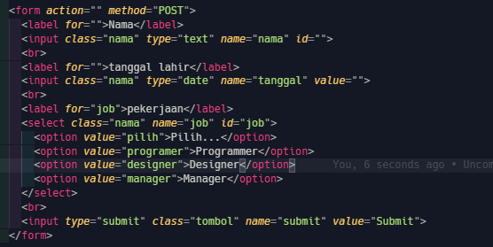
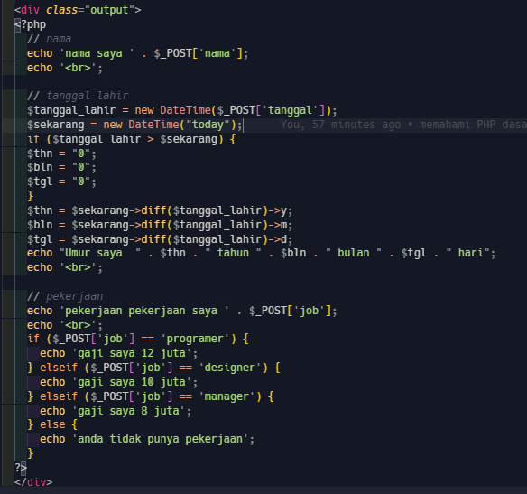
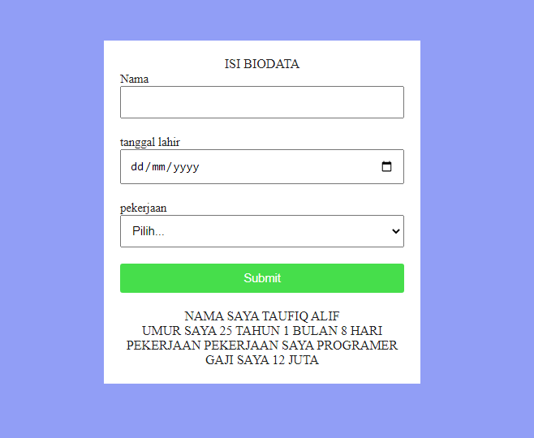

# PHP Dasar

PHP: Hypertext Preprocessor atau hanya PHP saja, adalah bahasa skrip dengan fungsi umum yang terutama digunakan untuk pengembangan web. Bahasa ini awalnya dibuat oleh seorang pemrogram Denmark-Kanada Rasmus Lerdorf pada tahun 1994. Implementasi referensi PHP sekarang diproduksi oleh The PHP Group.

## langkah - langkah praktikum 7

1. membuat file `lab7web.php`

2. membuat document HTML

3. membuat form

4. menjalankan fungsi form

5. hasil

